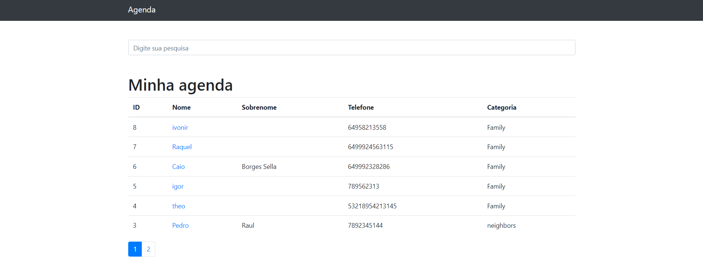

# Projeto Agenda

<p>Projeto em python, desenvolvido com a biblioteca Django</p>

<br>

<p>Status de desenvolvimento:<p/>

```
projeto finalizado
```

<hr>


<h3 align="center">Tela home</h3>



<h3 align="center">Tela de cadastro</h3>


<h3 align="center">Tela de login</h3>


<h3 align="center">Tela de dashboard</h3>


<p>Obs.: Caso queira testar o programa recomendo que crie um ambiente virtual em sua máquina.</p>